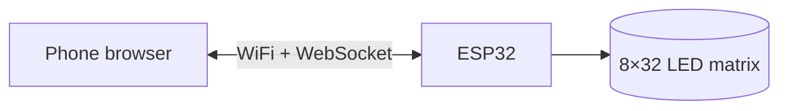

# ESP32 LED Snake

Snake on a 32×8 LED matrix, run by an ESP32 and played from any phone or laptop browser over the ESP32's own WiFi network. No app, no router, one USB cable.

<!-- When the demo GIF is ready, replace this comment with:

-->

## Features

- **Play from your phone:** d-pad, swipes, or arrow keys on a laptop. Pause, restart, live score.
- **Its own WiFi:** join `ESP32-Snake` and open `snake.local`. Works anywhere, no internet needed.
- **Attract screen:** a demo snake zigzags across the board while it waits for a player.
- **Crash animation and score:** the snake flashes and crumbles, then the score counts up on the matrix.
- **Walls or wrap-around** edges, chosen in Settings.
- **Colours:** pick the snake and food colours from presets or any colour, previewed live.
- **Effects:** pulsing head, fading tail, glowing food, a sparkle when you eat.
- **Sound** on your phone for start, eat and crash, and a snake that speeds up as it grows.
- **Remembers your settings** after power-off.
- **Runs from one USB cable,** with a firmware power cap keeping it safe.

## How it works



The ESP32 runs a WiFi access point, serves the controller page, and keeps a live WebSocket open to every phone: presses go in, score and game events come back. The game rules, the display, the controller and the settings are separate modules, coordinated by a state machine. See [architecture](docs/architecture.md) and the [controller protocol](docs/protocol.md) for details.

## What you need

| Part | Notes |
|---|---|
| ESP32 DevKit V1 (30-pin) | |
| WS2812B 8×32 flexible LED matrix | 256 LEDs |
| Electrolytic capacitor, 100–1000 µF, 10 V or higher | Across 5 V and GND, stripe to GND |
| Resistor, 330–470 Ω | In the data line |
| Breadboard, jumper wires, micro-USB data cable | |

Full parts list: [`hardware/bom.md`](hardware/bom.md).


<!-- When the wiring photo is ready, add:

-->

## Build and upload

1. Install **Arduino IDE 2**, the **esp32** board package (Espressif), and the libraries **FastLED**, **Async TCP** and **ESP Async WebServer** (both by ESP32Async).
2. Wire it as above.
3. Open `firmware/snake_matrix/snake_matrix.ino`, choose **DOIT ESP32 DEVKIT V1**, and upload.
4. Changing the controller page? Edit `controller/index.html`, then run `python3 tools/embed_page.py` before uploading.

New to this? The **[step-by-step build guide](docs/guide/README.md)** starts from installing the tools, one phase at a time.

Built and tested with Arduino IDE 2.3.10, esp32 3.3.11, FastLED 3.10.5, Async TCP 3.5.0 and ESP Async WebServer 3.12.1.

## How to play

1. Power the ESP32 over USB. The matrix shows the attract screen.
2. Join the WiFi network **ESP32-Snake** (password `playsnake`). It has no internet; that's expected.
3. Open **http://snake.local** (or **http://192.168.4.1**).
4. Press any direction to start. Steer with the d-pad, swipes, or arrow keys / W A S D.
5. **P** or Space pauses, **R** restarts. Locking your phone mid-game pauses automatically.
6. Between games, tap **Settings** for walls or wrap-around edges and the snake and food colours.
7. Sound follows your phone's silent switch. Sound and vibration can be turned off per device in Settings.

<!-- When screenshots are ready, add:
 
-->

## Project structure

```
firmware/snake_matrix/   the game (open snake_matrix.ino in Arduino IDE)
firmware/tests/          small sketches for bringing up and debugging the hardware
controller/              the controller page (source)
tools/                   embed_page.py: puts the page into the firmware
hardware/                parts list and wiring diagram
docs/                    build guide, architecture, protocol, story, build log, gotchas
```

## Documentation

- **[Build guide](docs/guide/README.md):** the whole project in ten phases, each linked to its code.
- **[The story of the build](docs/story.md):** goals, decisions, problems solved.
- **[Architecture](docs/architecture.md)** and **[controller protocol](docs/protocol.md)**.
- **[Gotchas](docs/gotchas.md):** pitfalls worth knowing before you start.
- **[Build log](docs/build-log.md):** what happened in each phase, as it happened.

## Versions

| Version | What's new |
|---|---|
| v2.1 | Phone sounds; the snake speeds up as it grows |
| v2.0 | Custom snake and food colours; pulsing head, fading tail, eat sparkle |
| v1.1 | Walls or wrap-around edges in Settings, saved in flash |
| v1.0 | Attract screen, full game, crash animation and score, phone controller |

Earlier tags (`v0.1`–`v0.5`) mark each phase of the build.

## License

MIT. See [`LICENSE`](LICENSE).
