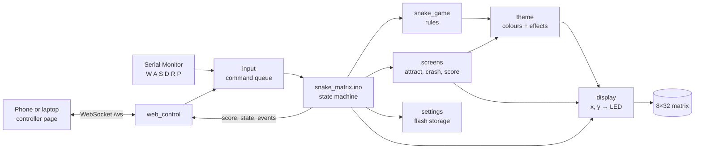
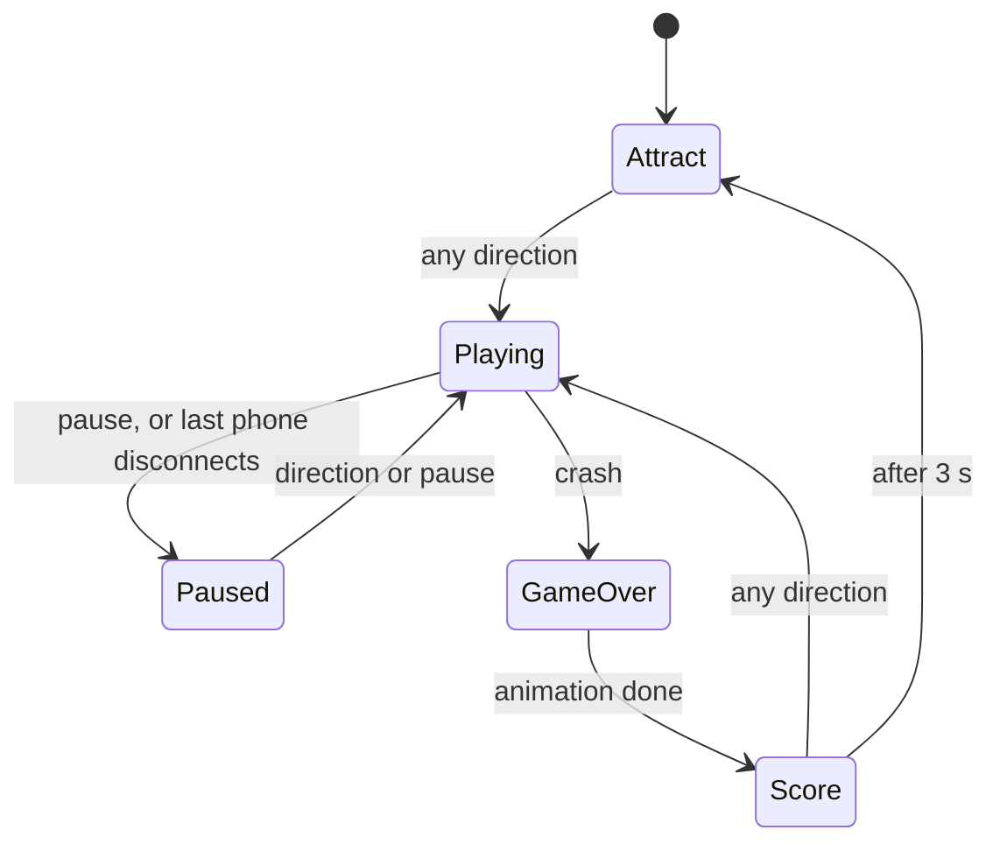

# Architecture

How the firmware and the controller page fit together, and why they're built this way.

## The big picture

Each module has one job, a `.h` file listing what it offers, and a `.cpp` file with how it works. Everything a module keeps to itself is `static`, so other modules can only reach it through its functions.

| Module | Job | Knows about |
|---|---|---|
| `snake_matrix.ino` | Runs the state machine, the clocks, and connects everything | All modules |
| `snake_game` | The rules: move, turn, eat, grow, walls or wrap, collisions | A grid. No LEDs, WiFi or Serial |
| `input` | Every command from any source, in one thread-safe queue | Directions and requests |
| `web_control` | WiFi hotspot, controller page, WebSocket | `input` (to deliver commands) |
| `theme` | Colours, normalising, head pulse, tail fade, food glow, sparkle | `display` |
| `screens` | Attract animation, crash animation, final score font | `snake_game`, `theme`, `display` |
| `display` | FastLED setup, the (x, y) → LED mapping, power cap | FastLED |
| `settings` | Wall mode and colours saved in flash (Preferences) | Nothing else |
| `config.h` | Every tweakable number in one place | — |
| `app_state.h` | The list of states | — |

The rules module knowing nothing about LEDs or WiFi is the decision that paid off most: the phone controller, the effects, the colour themes and the speed-up were all added without changing how the game itself works.

## The state machine

Exactly one state is active at a time. Every change goes through `enterState()`, which logs it to Serial Monitor and tells every connected controller.

Restart returns to Attract from any state. Settings (edges and colours) can only change in Attract, GameOver and Score, never during a game.

## Two clocks

While playing, two independent timers run in `loop()`, and neither ever calls `delay()`:

| Clock | Interval | What happens |
|---|---|---|
| Movement | `currentTickMs()`: 250 ms, 5 ms faster per food, down to 120 ms | The snake moves one square |
| Drawing | `FRAME_MS`: 30 ms | The whole picture is redrawn |

Redrawing only when the snake moved would make the head pulse, food glow and sparkle choppy, so drawing runs about eight times between moves. The attract and crash animations work the same way: each frame is calculated purely from the milliseconds since that screen started, so they never drift.

## Two tasks, one queue

The web server doesn't run inside `loop()`. It runs in its own background task (the ESP32 runs several tasks at once, on two cores). So a phone can push a direction into the input queue at the same moment `loop()` is taking one out.

`input.cpp` guards the queue with a critical section (`portENTER_CRITICAL` / `portEXIT_CRITICAL`), so only one task touches it at a time. The web task only ever *requests* things: it never changes the game directly. `loop()` picks requests up and acts on them.

The queue holds up to three directions, so two quick turns within one step both happen, in order, one per step.

## The ESP32 is the source of truth

The phone never assumes a setting has changed. Tapping "Wrap" or a colour sends a request; the page only highlights it once the ESP32 sends the new value back. That keeps every connected phone in sync, and means a page can never show a setting the game isn't using.

The same applies to colours: the ESP32 normalises them to full strength (so dark picks stay visible on the matrix) and sends the normalised colour back for the page to display.

## Power

Everything runs from one USB cable, which can supply roughly 500 mA for the whole board. FastLED's power cap (`MAX_MILLIAMPS`, 300 mA) dims any frame that would draw more. The game design follows from this: a few bright pixels on a dark board, never a fully lit screen. If the cap is set too high, the ESP32 resets and reports a brownout.

## The controller page

The page is a single file, `controller/index.html` (HTML, CSS and JavaScript together). `tools/embed_page.py` wraps it into `firmware/snake_matrix/controller_page.h` as a C++ raw string, so it's stored inside the firmware and served from flash. Edit the `.html`, re-run the script, re-upload.

Sound is synthesised in the browser with the Web Audio API. Sound and vibration preferences are stored in the browser's localStorage, since they're per device; everything else lives on the ESP32.

See [`protocol.md`](protocol.md) for every message between the page and the ESP32.
