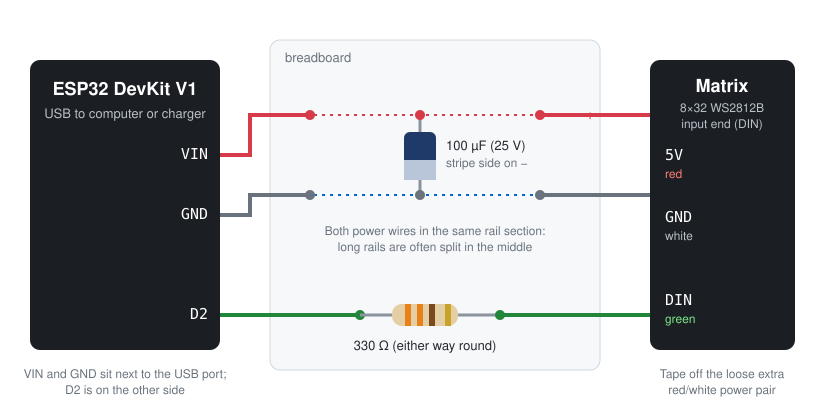

# Phase 2: Power and first light

**Goal:** wire the matrix to the ESP32, light it up, and prove the firmware power cap keeps USB power safe.

**Code at the end of this phase:** [`v0.2`](https://github.com/rkdotxyz/esp32-led-snake/tree/v0.2) (`firmware/tests/t02_first_pixels` and `t04_power_cap`)

## Why power matters

256 LEDs at full white can draw around 15 A. A USB port supplies roughly 500 mA for everything, and the ESP32 takes a share of that. So the whole project runs on a **power cap**: one line of FastLED that dims any frame that would draw more than a set amount.

```cpp
FastLED.setMaxPowerInVoltsAndMilliamps(5, MAX_MILLIAMPS);   // 300 mA
```

Go over the budget and the ESP32 resets with `Brownout detector was triggered`. That message means power, not a code bug.

## Identify your parts

- **Resistor:** 330 Ω is orange-orange-brown(-gold); 470 Ω is yellow-violet-brown(-gold). Five-band resistors add a black band. Either value works, either way round.
- **Capacitor:** the cylinder. The pale stripe with minus signs marks the negative leg, which is also the shorter one. **Direction matters:** the stripe goes to GND. Its voltage rating must be at least 10 V.
- **Matrix input end:** look for **DIN** printed near the pads (the other end says DOUT). Small arrows point away from the input. The 3-wire plug is usually red = 5 V, white = GND, green = data, but trust the printed labels over wire colours.

## Wire it

Unplug USB while wiring. Everything is powered from the ESP32's USB cable.



| From | To | Notes |
|---|---|---|
| ESP32 VIN | breadboard + rail | VIN, not 3V3: on USB, VIN carries 5 V |
| ESP32 GND | breadboard − rail | |
| Capacitor | across + and − | long leg on +, stripe on − |
| + rail | matrix 5V (red) | |
| − rail | matrix GND (white) | |
| ESP32 D2 | resistor | D2 is GPIO2 |
| resistor | matrix DIN (green) | the resistor bridges two separate breadboard rows |

**Tape off** the matrix's loose extra red/white power pair: it's live once the matrix is powered.

The 30-pin ESP32 is almost as wide as a breadboard. If it doesn't leave a free hole next to the pins you need, keep it off the breadboard and run jumpers straight from its pins.

## Before you plug in USB

- [ ] Red goes to VIN, not 3V3.
- [ ] The capacitor stripe is on the − rail.
- [ ] The data wire is at the **DIN** end.
- [ ] The resistor is only in the data line.
- [ ] **Both power wires are in the same rail section.** Many long breadboards split each rail in the middle.
- [ ] No bare metal touches anything it shouldn't.

If macOS says "USB accessories disabled", unplug immediately: that's a short.

## t02_first_pixels

Lights the first LED red, green, then blue (checking the colour order), then walks one white dot through all 256 LEDs in the order they're chained. The core idea, which every later sketch uses: change colours in an array in memory, then send the whole array with `show()`.

```cpp
leds[dot] = CRGB::Black;   // switch off the old position
dot++;
leds[dot] = CRGB::White;   // switch on the new one
FastLED.show();            // nothing changes on the matrix until this
```

It also prints why the ESP32 last started, so a brownout is easy to spot:

```cpp
case ESP_RST_BROWNOUT: Serial.println("BROWNOUT: the LEDs drew more power than USB could supply"); break;
```

**Watch the dot's path:** it tells you how the matrix is wired internally, which phase 3 needs. On this matrix, LED 0 is top left and the chain runs down column 0, up column 1, down column 2, and so on.

## t04_power_cap

The worst case: every LED white, asking for more brightness every 4 seconds. Serial Monitor shows what was requested, what the cap allowed, and FastLED's current estimate. On this build, full white is capped at **6/255**, and the ESP32 never resets. Very dim, which is exactly why the game uses a few bright pixels on a dark board.

## What to check

- [ ] LED 0 shows red, green and blue in the right order (so `GRB` is correct).
- [ ] The dot walks through all 256 LEDs without flicker.
- [ ] `t04_power_cap` shows "(cap active)" and never a BROWNOUT.

## What went wrong for me

- **Serial Monitor showed the chase running, but nothing lit up.** The breadboard's power rails were split around column 30: the ESP32's VIN and GND went into one half, the matrix into the other. Moving the matrix wires into the same section fixed it.
- **I only had a 100 µF capacitor**, not the 1000 µF originally planned. On USB power with the cap in place, 100 µF is plenty.
- **Garbage characters after every upload.** Those are the ESP32's boot messages at 74880 baud. Normal.

## If something's wrong

| Symptom | Likely cause and fix |
|---|---|
| Nothing lights | Data wire at DOUT; power in a different rail section; resistor in a rail instead of two rows. |
| Random colours or flicker | Loose GND, or a long data wire. Reseat GND; keep the data wire short. |
| Wrong colours in the test | Colour order. Change `GRB` to `RGB` in `addLeds`. |
| Chase stops at one LED | That LED may be damaged. Note the last number printed. |
| ESP32 keeps restarting | Brownout. Lower `MAX_MILLIAMPS`, or try another USB port or a phone charger. |
| Upload stuck with matrix attached | GPIO2 is also a boot pin. Unplug the data wire during upload. |
| Capacitor warm or bulging | It's backwards. Unplug and replace it. |

**Next:** [Phase 3: Map the grid](03-map-the-grid.md)
