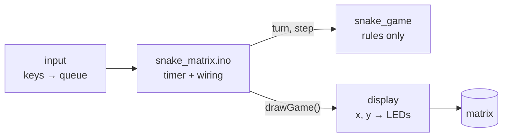

# Phase 4: Snake core

**Goal:** a playable Snake on the matrix (moving, eating, growing, dying), steered from Serial Monitor. No WiFi yet, and no wiring changes.

**Code at the end of this phase:** [`v0.4`](https://github.com/rkdotxyz/esp32-led-snake/tree/v0.4/firmware/snake_matrix)

## A sketch in several files

The game lives in `firmware/snake_matrix/`. Instead of one long file, it's split into modules, each with one job:



| File | Job |
|---|---|
| `config.h` | Every tweakable number: pin, sizes, power cap, speed, colours |
| `display.h` / `.cpp` | FastLED setup, `XY()`, `displaySetPixel()`: the only code that touches LEDs |
| `snake_game.h` / `.cpp` | The rules. Knows about a grid and a snake, nothing else |
| `input.h` / `.cpp` | W A S D and R from Serial, through a small queue |
| `snake_matrix.ino` | Connects them: read keys, step the game on a timer, draw |

Three C++ ideas make this work:

- **`.h` and `.cpp`.** The `.h` is the menu: what a module offers. The `.cpp` is the kitchen: how it works. Other files `#include` the menu and never see the kitchen.
- **`static`.** A variable marked `static` in a `.cpp` is private to that file. The snake can only be read through functions like `gameSegment()`, so nothing else can change it by accident.
- **`#pragma once`** at the top of every `.h` stops it being included twice.

**Creating the files:** make the folder `firmware/snake_matrix/`, then either create each file in VS Code, or in Arduino IDE use ⋯ → New Tab and type the exact name. All eight files sit flat in the folder: the Arduino IDE ignores subfolders, and the folder name must match `snake_matrix.ino`.

A bonus: the IDE only auto-generates function declarations for the `.ino`. Putting custom types (`Direction`, `Point`) in `.h` files avoids the "does not name a type" errors that auto-generation can cause.

## The rules

The snake is a list of points, head first. Each step, every segment moves into the place of the one ahead, and the head moves one square:

```cpp
// 4. Hit itself? When not eating, the tail tip moves away this same
//    step, so the head may move into it: check one segment fewer.
int segmentsToCheck = eating ? length : length - 1;
if (isOnSnake(next, segmentsToCheck)) {
  over = true;
  reason = "hit itself";
  return;
}

// 5. Move. Growing just means keeping the tail.
if (eating) {
  length++;
}
for (int i = length - 1; i > 0; i--) {
  body[i] = body[i - 1];
}
body[0] = next;
```

Food is placed by counting the free squares, picking one at random, and walking the board to find it. It always takes the same time, even when the board is nearly full. On the ESP32, `random()` uses a hardware random number generator, so no seeding is needed.

## Why a queue for input

The snake moves once per tick (every 250 ms). If you press up then left quickly within one tick, a single "latest key" variable would lose the up. A three-slot queue keeps both, used one per tick. Reversing straight into yourself is ignored by the rules.

## Play it

Upload, open Serial Monitor, type `w`, `a`, `s` or `d` and press Enter. You can type several at once (`wd` + Enter) to queue two turns. `r` restarts.

## What to check

- [ ] A 3-segment snake starts heading right, with one food pixel.
- [ ] W A S D turn it; reversing does nothing; quick double turns both happen.
- [ ] Eating grows it by one and prints the score.
- [ ] Walls and your own body end the game; R restarts.

## What went wrong for me

- **Real-time play from a terminal didn't work.** Serial Monitor needs Enter after every key, so I tried terminal tools that send each keypress immediately. `screen` exited straight away; `tio` connected but ignored keys, most likely because opening the port toggles the ESP32's reset lines (DTR/RTS). I parked it: the browser controller in phase 5 replaces keyboard play anyway.
- **VS Code showed red errors** on the sketch. It doesn't know where the Arduino libraries live. Arduino IDE compiled it fine, and that's what counts.

## If something's wrong

| Symptom | Likely cause and fix |
|---|---|
| "No such file or directory" | A tab name doesn't match an `#include`, like `snake-game.h` instead of `snake_game.h`. |
| "was not declared in this scope" | A file is empty or missing its `#include` lines. |
| "multiple definition of…" | Code pasted into the wrong tab, so a function exists twice. |
| Up goes down | The matrix is upside down compared with phase 3. |

**Next:** [Phase 5: Browser controller](05-browser-controller.md)
