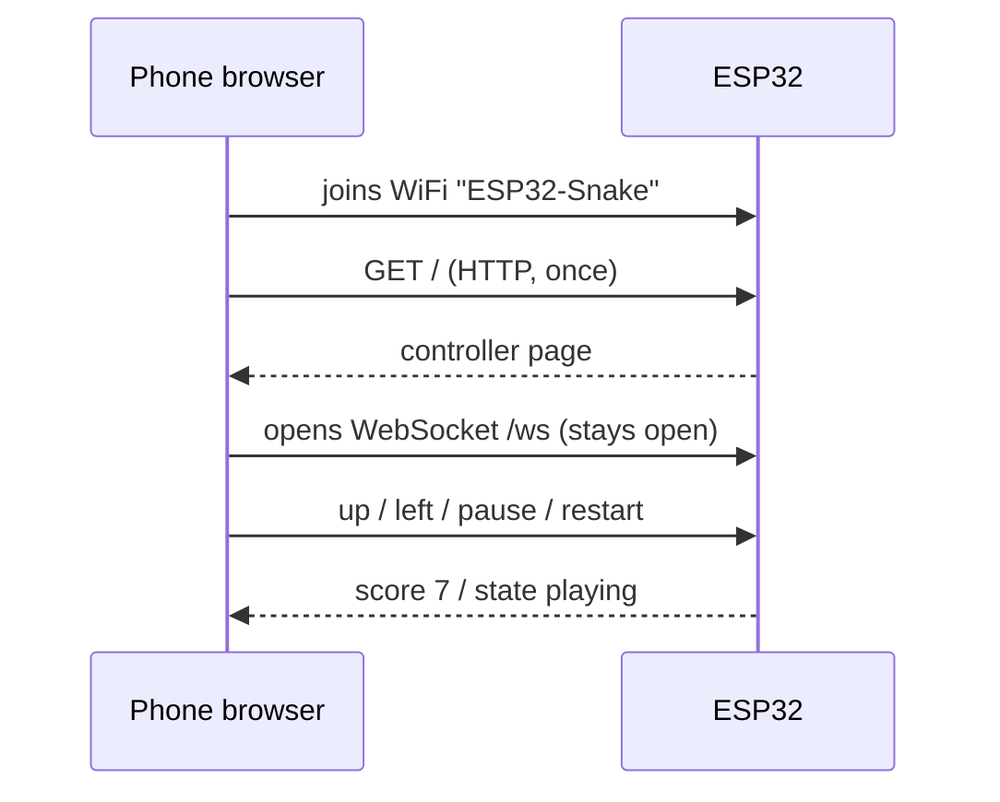

# Phase 5: Browser controller

**Goal:** play from any phone or laptop browser. The ESP32 creates its own WiFi network and serves a controller page. No wiring changes.

**Code at the end of this phase:** [`v0.5`](https://github.com/rkdotxyz/esp32-led-snake/tree/v0.5)

> This was originally planned as phase 6. It was swapped forward because keyboard play over a terminal didn't work well (see phase 4), and the controller replaces it.

## How it works



- **The ESP32 is the network.** It runs as an access point, a tiny WiFi router with no internet. Your phone joins it directly, so it works anywhere, with no router or login.
- **WebSocket, not page loads.** The page is fetched once; then a WebSocket stays open, so presses arrive in milliseconds and the ESP32 can push the score back without being asked.
- **Two tasks, one queue.** The web server runs in its own background task, alongside `loop()`. Both touch the input queue, so it's now guarded by a lock.

## New and changed files

| File | Status | Job |
|---|---|---|
| `controller/index.html` | New | The controller: d-pad, swipes, keyboard, pause, restart, live score |
| `tools/embed_page.py` | New | Wraps the page into a C++ string |
| `controller_page.h` | Generated | Made by the script; never edit by hand |
| `web_control.h` / `.cpp` | New | Hotspot, `snake.local` name, web server, WebSocket |
| `config.h` | Changed | Network name, password, host name |
| `input.h` / `.cpp` | Changed | Any source can push commands; pause; the lock |
| `snake_matrix.ino` | Changed | Ready and paused states; score and state sent to phones |

`display` and `snake_game` didn't change at all. That's the payoff of keeping the rules separate.

## The page lives in the firmware

The page is written as a normal `controller/index.html`, so it can be edited with proper highlighting and previewed in a desktop browser. The ESP32 has no separate file storage set up here, so `tools/embed_page.py` wraps the page into `firmware/snake_matrix/controller_page.h` as one C++ raw string:

```cpp
const char CONTROLLER_PAGE[] = R"rawliteral(<!DOCTYPE html> ... )rawliteral";
```

A raw string keeps everything exactly as written, so the HTML's quotes need no escaping. **Run the script every time you change the page:**

```bash
python3 tools/embed_page.py
```

## Messages

Every message is a short word, easy to read and debug. Full list in [`protocol.md`](../protocol.md).

```cpp
static void handleMessage(const char* text) {
  if      (strcmp(text, "up") == 0)      inputPushDirection(DIR_UP);
  else if (strcmp(text, "down") == 0)    inputPushDirection(DIR_DOWN);
  // ...
  else if (strcmp(text, "pause") == 0)   inputRequestPause();
}
```

## The lock

The web task might add a direction at the same moment `loop()` takes one out. A critical section lets only one task inside at a time:

```cpp
static portMUX_TYPE inputLock = portMUX_INITIALIZER_UNLOCKED;

void inputPushDirection(Direction d) {
  portENTER_CRITICAL(&inputLock);
  // ... add to the queue ...
  portEXIT_CRITICAL(&inputLock);
}
```

## Two game changes

- A new game waits for the first direction, so you have time to pick up your phone.
- If the last phone disconnects mid-game (screen locked, walked away), the game pauses instead of letting the snake crash.

## Connect and play

1. Join the WiFi network **ESP32-Snake**, password **playsnake**. Your iPhone will say "No Internet Connection". That's expected; stay on it.
2. Open **http://snake.local**, or **http://192.168.4.1** if that doesn't load. Type the `http://`.
3. The dot turns green. Press any direction to start.

A Mac on the hotspot has no internet while it's connected (it joins one network at a time). Serial Monitor keeps working over USB.

## What to check

- [ ] Serial Monitor prints "WiFi hotspot ready" with the address.
- [ ] The page loads and shows Connected.
- [ ] D-pad, swipes and arrow keys all steer; score updates live.
- [ ] Pause, auto-pause on disconnect and restart work.
- [ ] Two devices can connect at once and see the same score.

## What went wrong for me

- **The embed script printed nothing.** `embed_page.py` had been created but the code never pasted in and saved: Python ran an empty file. Always check for VS Code's unsaved dot on a tab.
- **Naming.** The module was first planned as `network.h`. The ESP32 core has its own `Network.h`, and macOS treats the two names as the same file, which would break the build. Hence `web_control`.

## If something's wrong

| Symptom | Likely cause and fix |
|---|---|
| `controller_page.h: No such file` | Run the embed script from the repo root, then reopen the sketch. |
| ESP32-Snake doesn't appear | Check Serial Monitor for "WiFi hotspot ready"; if it keeps restarting, it's a brownout. |
| BROWNOUT after adding WiFi | WiFi adds current bursts. Lower `MAX_MILLIAMPS` to 250. |
| snake.local won't load | Use `http://192.168.4.1`. `.local` support varies, especially on Android. |
| Stuck on "Reconnecting…" | Cached page from before a restart: reload. |
| Phone drops off the hotspot | It prefers networks with internet. Turn off Auto-Join for your home WiFi while testing. |

**Next:** [Phase 6: Attract screen and game over](06-attract-and-game-over.md)
