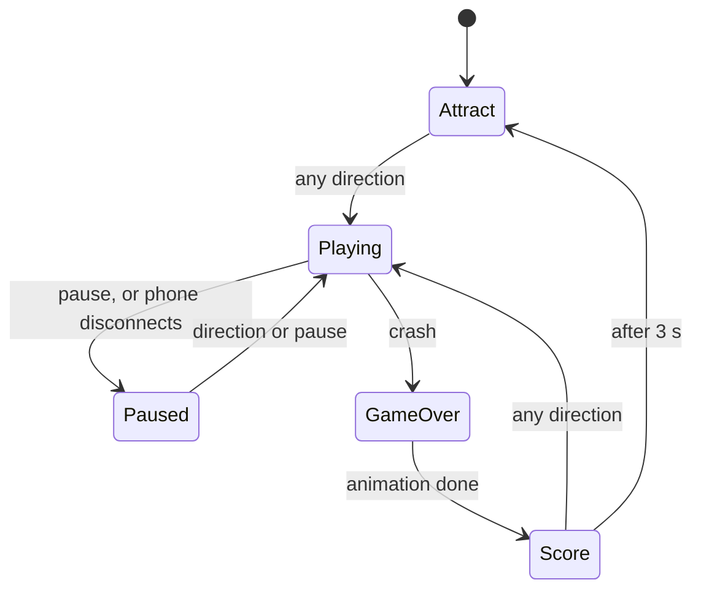

# Phase 6: Attract screen and game over (v1.0)

**Goal:** the screens around the game: a demo snake while waiting for a player, a crash animation, and the final score counting up on the matrix. With phase 5's controller, this is version 1.

**Code at the end of this phase:** [`v1.0`](https://github.com/rkdotxyz/esp32-led-snake/tree/v1.0)

## One screen at a time: a state machine

A few true/false flags (paused, started, over) got tangled once animations arrived. So the sketch now has an explicit list of states in `app_state.h`, and exactly one is active:



Each state has its own small `update…()` function, and every change goes through `enterState()`, which logs it and tells the phones:

```cpp
switch (state) {
  case STATE_ATTRACT:   updateAttract(now);                 break;
  case STATE_PLAYING:   updatePlaying(now, pausePressed);   break;
  case STATE_PAUSED:    updatePaused(pausePressed);         break;
  case STATE_GAME_OVER: updateGameOver(now);                break;
  case STATE_SCORE:     updateScore(now);                   break;
}
```

`AppState` lives in its own header because functions in the `.ino` take it as a parameter, and the IDE's auto-generated declarations only understand types from an `#include`.

## New ideas

**Frames from the clock.** Each animation frame is calculated from one number: milliseconds since that screen started. Nothing is stored between frames, so nothing drifts.

**A route that covers the board.** The attract snake follows a loop that visits all 256 squares exactly once and joins back up: zigzag across columns 1–31 row by row, then back up column 0. It works because there's an even number of rows, so the last row ends next to column 0.

```cpp
static void loopPoint(int i, int &x, int &y) {
  const int zigzagWidth = MATRIX_WIDTH - 1;              // columns 1-31
  const int zigzagSquares = zigzagWidth * MATRIX_HEIGHT; // 248
  if (i < zigzagSquares) {
    int row = i / zigzagWidth;
    int along = i % zigzagWidth;
    y = row;
    x = (row % 2 == 0) ? 1 + along : zigzagWidth - along;
  } else {
    x = 0;                                               // the way back up
    y = (MATRIX_HEIGHT - 1) - (i - zigzagSquares);
  }
}
```

**A font made of bits.** Each digit is six numbers, one per row; each `1` bit is a lit pixel.

```cpp
{0b01110, 0b10001, 0b10001, 0b10001, 0b10001, 0b01110},  // 0
```

## What you'll see

- **Attract:** a snake zigzagging across a dark board, eating apples and growing.
- **Game over:** the snake flashes red three times, then crumbles from the tail.
- **Score:** amber digits counting up to your score, centred, on rows 1–6. A direction plays again; otherwise it returns to the attract screen after 3 seconds.

## Design changes after testing

- **No background glow on the attract screen.** The first version lit every LED faintly. Just the snake and apples on a dark board looked cleaner.
- **A 6-row font.** The first font was 7 rows, which left the bottom row empty and looked top-heavy. A 5×6 font sits centred with the top and bottom rows free.
- **Leading zeros while counting.** Counting to 12 went 0, 1 … 9, 10, 11, 12, so single digits looked right-aligned. Now it counts 00, 01 … 12 using `%0*d`:

```cpp
snprintf(text, sizeof(text), "%0*d", digitCount, shown);  // zero-padded to the final score's width
```

## Tuning

In `config.h`: `ATTRACT_STEP_MS` (attract speed), `SCORE_SHOW_MS` (how long the score stays), `SCORE_COLOUR`, `FRAME_MS` (animation smoothness).

## What to check

- [ ] Power-up shows the attract screen; a direction starts a game.
- [ ] Crashing flashes, crumbles, then shows the score.
- [ ] Presses during the crash animation are ignored.
- [ ] Pause, auto-pause and restart still work.

## If something's wrong

| Symptom | Likely cause and fix |
|---|---|
| "AppState does not name a type" | `app_state.h` missing or misnamed. |
| New functions "not declared" | New tabs not picked up: close and reopen the sketch. |
| Digits look wrong | A row of the font table changed while copying. |
| Phone shows the old game-over text | Embed script not re-run, or cached page. |

**Next:** [Phase 7: Walls and wrap](07-walls-and-wrap.md)
